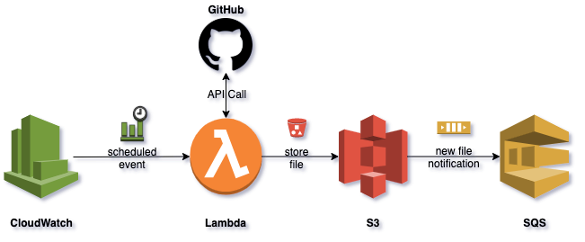

# aws_lambda_s3_sqs_cw



AWS Terraform Project with:
- Lambda serverless implementation (Python)
- S3 bucket for storage
- SQS queue for notifications
- CW scheduling to trigger Lambda

## To deploy:

```shell
$ zip -r lambda.zip lambda.py
$ terraform init
$ terraform apply
```
